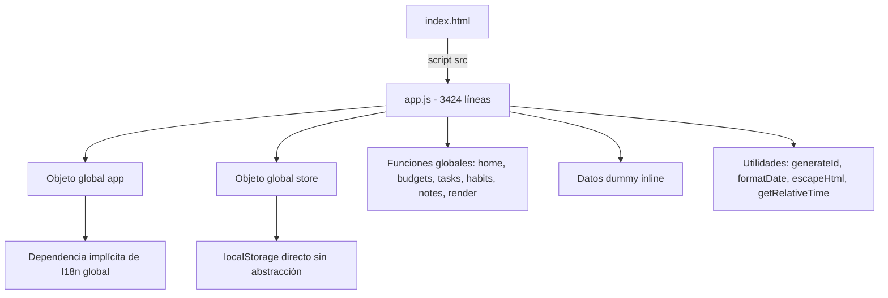
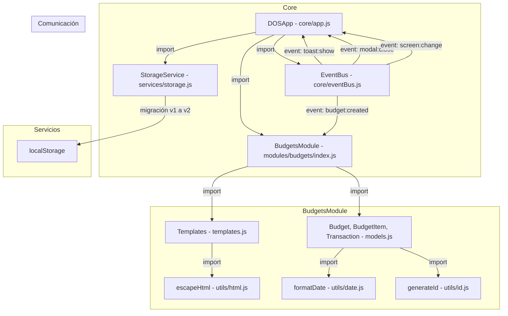
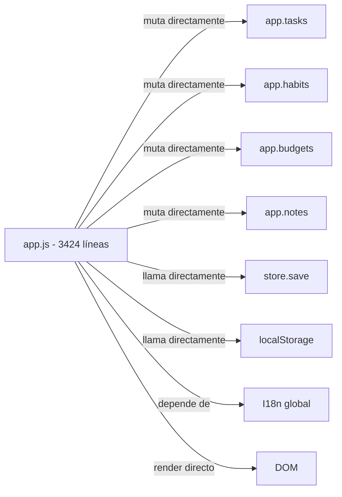
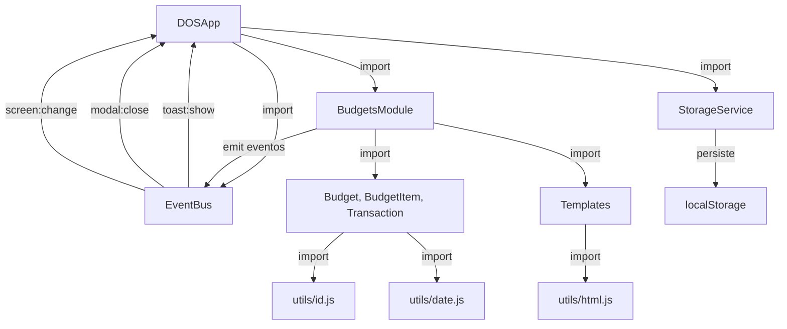

# Migración de JavaScript Monolítico a Módulos ES6

> **Estado:** En progreso — Módulo de presupuestos migrado, resto pendiente
> **Cambio principal:** Transición de un archivo monolítico `app.js` (3,424
> líneas) a una arquitectura modular basada en ES6 Modules

---

## Resumen

Uno de los objetivos en el aprendizaje de JavaScript es ir paso a paso, ahora
toca el turno de pasar un archivo monolítico y global a una arquitectura moderna
basada en **ES6 Modules**. Este es el cambio más importante porque sienta las
bases para que la aplicación pueda escalar de forma confiable, mantenerse y
evolucionar de forma sostenible. En lugar de tener toda la lógica en un solo
archivo con variables globales y funciones sueltas, ahora cada responsabilidad
tiene su propio módulo con `import`/`export`, clases bien definidas y
comunicación desacoplada mediante un EventBus.

Otro punto importante es definir las pruebas de código para validar las
funcionalidades del sistema, antes eso era muy complicado de realizar, ahora al
pasar a módulos se pueden aislar las pruebas de forma mas controlada y
aprovechar frameworks como vitest que ayudan mucho para definir de forma
ordenada y con herramientas poderosas el código necesario para probar la
aplicación.

---

## 1. El Problema: Arquitectura Monolítica Anterior

### 1.1 Archivo `app.js` — 3,424 líneas

El archivo [`assets/js/app.js`](../assets/js/app.js) concentraba **toda** la
lógica de la aplicación:

| Problema                                | Descripción                                                                                                 |
| --------------------------------------- | ----------------------------------------------------------------------------------------------------------- |
| **Archivo gigante**                     | 3,424 líneas en un solo archivo, imposible de navegar eficientemente                                        |
| **Variables globales**                  | `const app = { ... }`, `let currentScreen`, `let visitCount` vivían en el scope global                      |
| **Funciones sueltas**                   | `home()`, `budgets()`, `tasks()`, `habits()`, `notes()`, `render()` eran funciones globales                 |
| **Objeto literal como app**             | `const app = { init(), navigateTo(), tasks: [], ... }` — sin clase, sin constructor, sin encapsulación real |
| **Almacenamiento acoplado**             | `const store = { init(), save(), load() }` — lógica de persistencia mezclada con la UI                      |
| **Datos de demo embebidos**             | `dummyTasks`, `dummyHabits`, `dummyBudget`, `dummyNotes` dentro del mismo archivo                           |
| **Sin separación de responsabilidades** | Modelos, vistas, lógica de negocio y datos todo junto                                                       |
| **Dependencias implícitas**             | Las funciones dependían de `I18n`, `app`, `store` como variables globales sin importación explícita         |
| **HTML inline en JS**                   | Templates HTML construidos con concatenación de strings y template literals sin escapado                    |
| **Sin sistema de eventos**              | Los módulos se comunicaban mutando estado global directamente                                               |

### 1.2 Estructura antigua

```
assets/js/
├── app.js              ← 3,424 líneas, TODO aquí
├── theme.js            ← Script suelto para tema
├── analytics.js        ← Script suelto para analíticos
└── tailwindcss.js      ← CDN helper
```



---

## 2. La Solución: Arquitectura Modular con ES6 Modules

### 2.1 Nueva estructura de carpetas

```
assets/js/
├── core/                        # Núcleo de la aplicación
│   ├── app.js                   # Clase DOSApp - orquestador principal
│   └── eventBus.js              # Sistema de eventos desacoplado
│
├── modules/                     # Módulos de funcionalidad
│   ├── budgets/                 # ✅ Módulo de presupuestos (MIGRADO)
│   │   ├── index.js             # Clase BudgetsModule
│   │   ├── models.js            # Clases Budget, BudgetItem, Transaction
│   │   └── templates.js         # Tagged template literals con escape automático
│   ├── tasks/                   # 🔲 TODO: Módulo de tareas
│   ├── habits/                  # 🔲 TODO: Módulo de hábitos
│   ├── notes/                   # 🔲 TODO: Módulo de notas
│   └── home/                    # 🔲 TODO: Dashboard / MITs
│
├── services/                    # Servicios compartidos
│   └── storage.js               # StorageService con migración de datos
│
├── utils/                       # Utilidades puras
│   ├── id.js                    # generateId, generateIds, isValidId
│   ├── date.js                  # formatDate, getTodayString, getLastNDays, getRelativeTime, generatePastRecords
│   └── html.js                  # escapeHtml, createElementFromHtml, setTextContent, setHtmlContent
│
└── data/
    └── demoData.js              # Datos de demostración separados de la lógica
```

### 2.2 Arquitectura con ES6 Modules



---

## 3. Cambios Detallados

### 3.1 🏆 Cambio Principal: ES6 Modules con `import`/`export`

Este es el cambio más significativo. Se pasa de un modelo de **scripts
globales** a **módulos ES6** con dependencias explícitas.

> Es importante mencionar que los módulos ES6 de JavaScript son una
> característica del lenguaje que permite dividir el código en archivos
> independientes que pueden ser importados y exportados entre sí.
>
> Es una característica moderna y muy potente que esta presente en todos los
> proyectos de JavaScript modernos y es muy importante conocerla.

#### Antes — Script global sin módulos

```javascript
// assets/js/app.js — Todo en un archivo, sin imports
function generateId() {
  return Date.now().toString(36) + Math.random().toString(36).substr(2)
}

function formatDate(date) {
  // ...
}

function escapeHtml(text) {
  const div = document.createElement("div")
  div.textContent = text
  return div.innerHTML
}

const app = {
  tasks: [],
  habits: [],
  budgets: [],
  notes: [],
  init: function () {
    /* ... */
  },
  navigateTo: function (screen) {
    /* ... */
  }
  // ... 30+ métodos más
}
```

#### Después — ES6 Modules con `import`/`export`

```javascript
// assets/js/utils/id.js — Módulo independiente
export function generateId() {
  return Date.now().toString(36) + Math.random().toString(36).substring(2)
}

export function generateIds(count) {
  return Array.from({ length: count }, () => generateId())
}

export function isValidId(id) {
  return typeof id === "string" && id.length >= 10
}
```

```javascript
// assets/js/core/app.js — Orquestador con imports explícitos
import { BudgetsModule } from "../modules/budgets/index.js"
import { StorageService } from "../services/storage.js"
import { EventBus } from "./eventBus.js"

export class DOSApp {
  constructor() {
    this.storage = new StorageService()
    this.eventBus = new EventBus()
    this.modules = {}
    this.currentScreen = "home"
  }

  async init() {
    this.storage.init()
    this._initModules()
    this._bindGlobalEvents()
    this.navigateTo(this._getInitialScreen())
  }
}

export const app = new DOSApp()
```

**Beneficios clave:**

| Aspecto            | Antes                                | Después                                  |
| ------------------ | ------------------------------------ | ---------------------------------------- |
| **Dependencias**   | Implícitas — variables globales      | Explícitas — `import`/`export`           |
| **Scope**          | Global — contaminación del namespace | Módulo — cada archivo es su propio scope |
| **Reutilización**  | Imposible sin copiar código          | Importar donde se necesite               |
| **Testing**        | Difícil — dependencias globales      | Fácil — se pueden mockear imports        |
| **Tree-shaking**   | No aplicable                         | Preparado para bundlers futuros          |
| **Mantenibilidad** | Archivo gigante                      | Archivos pequeños y enfocados            |

### 3.2 Clases ES6 en vez de Objetos Literales

#### Antes — Objeto literal

```javascript
const store = {
  init: function () {
    /* ... */
  },
  save: function (data, namespace) {
    /* ... */
  },
  load: function (namespace, typeData) {
    /* ... */
  }
  // ...
}
```

#### Después — Clase ES6 con encapsulación

```javascript
export class StorageService {
  static STORAGE_KEY = "dos-app-data-v2"
  static LEGACY_KEYS = [
    "tasks",
    "habits",
    "budgets",
    "notes",
    "dos-app-data-v1"
  ]

  constructor() {
    this.cache = null // Estado privado por instancia
  }

  init() {
    const data = this._loadRaw()
    if (data) {
      this.cache = data
      return
    }
    const migrated = this._migrateLegacyData()
    // ...
  }

  // Métodos privados por convención (_prefijo)
  _loadRaw() {
    /* ... */
  }
  _migrateLegacyData() {
    /* ... */
  }
  _validateData(data) {
    /* ... */
  }
  _getEmptyData() {
    /* ... */
  }
}
```

**Mejoras:**

- **Constructor explícito** — Estado inicial claro en `constructor()`
- **Propiedades estáticas** — `STORAGE_KEY` y `LEGACY_KEYS` son de la clase, no
  de la instancia
- **Métodos privados por convención** — `_loadRaw()`, `_migrateLegacyData()`
  indican uso interno
- **Cache interno** — `this.cache` evita lecturas innecesarias de localStorage
- **Migración automática** — Detecta y migra datos de formatos v1 a v2

### 3.3 EventBus — Comunicación Desacoplada

La idea del EventBus es muy simple, crear un mecanismo para que los módulos se
comuniquen entre sí sin conocerse directamente. De esta forma se logra un mayor
desacoplamiento entre los módulos y se facilita el mantenimiento de la
aplicación.

#### Antes — Llamadas directas y mutación global

```javascript
// En app.js — todo acoplado
const app = {
  deleteTask(taskId) {
    const index = app.tasks.findIndex(t => t.id === taskId)
    if (index !== -1) {
      app.tasks.splice(index, 1)
      store.save(app.tasks, "tasks")
      tasks() // Re-render directo
    }
  }
}
```

#### Después — EventBus para comunicación entre módulos

```javascript
// assets/js/core/eventBus.js
export class EventBus {
  constructor() {
    this.events = {}
  }

  on(event, callback) {
    if (!this.events[event]) this.events[event] = []
    this.events[event].push(callback)
    return () => {
      this.events[event] = this.events[event].filter(cb => cb !== callback)
    }
  }

  once(event, callback) {
    /* ... */
  }
  off(event, callback) {
    /* ... */
  }
  emit(event, data) {
    /* ... */
  }
  removeAllListeners(event) {
    /* ... */
  }
}
```

```javascript
// En BudgetsModule — emite eventos
this.eventBus.emit("budget:created", budget)
this.eventBus.emit("budget:deleted", deleted)

// En DOSApp — escucha eventos
this.eventBus.on("toast:show", ({ message, type }) => {
  this.showToast(message, type)
})
this.eventBus.on("modal:close", () => this.closeModal())
this.eventBus.on("screen:change", ({ screen }) => this.navigateTo(screen))
```

**Ventajas del EventBus:**

- Los módulos **no se conocen entre sí** directamente
- Se pueden agregar nuevos módulos sin modificar los existentes
- Fácil de testear — se puede mockear el EventBus
- La suscripción retorna una función de `unsubscribe` para limpieza

### 3.4 Modelos con Serialización

Crear modelos serializados para que puedan ser guardados y recuperados del
localStorage, es una forma de usar clases para modelar los datos de la
aplicación y darles comportamiento. De esta forma podemos tener métodos que nos
ayuden a validar, transformar o calcular datos sin salirnos del modelo.

#### Antes — Objetos planos sin comportamiento

```javascript
// En app.js — objetos literales sin métodos
const dummyBudget = [
  {
    id: generateId(),
    name: "Monthly Personal Budget",
    currency: "USD",
    items: [{ id: generateId(), title: "Groceries", amount: 500 }],
    transactions: [
      { id: generateId(), amount: -45, description: "Weekly groceries" }
    ]
  }
]
```

#### Después — Clases con comportamiento y serialización

```javascript
// assets/js/modules/budgets/models.js
export class Budget {
  constructor(data = {}) {
    this.id = data.id || generateId()
    this.name = data.name || "New Budget"
    this.currency = data.currency || "USD"
    this.items = (data.items || []).map(i =>
      i instanceof BudgetItem ? i : BudgetItem.fromJSON(i)
    )
    this.transactions = (data.transactions || []).map(t =>
      t instanceof Transaction ? t : Transaction.fromJSON(t)
    )
  }

  getTotalAllocated() {
    return this.items.reduce((sum, item) => sum + item.amount, 0)
  }
  getTotalSpent() {
    return this.transactions
      .filter(t => t.isExpense())
      .reduce((sum, t) => sum + t.getAbsoluteAmount(), 0)
  }
  getRemaining() {
    return this.getTotalAllocated() - this.getTotalSpent()
  }
  getUsagePercentage() {
    /* ... */
  }
  getStatus() {
    /* ... */
  }

  toJSON() {
    return { id: this.id, name: this.name /* ... */ }
  }
  static fromJSON(data) {
    return new Budget(data)
  }
  static validate(data) {
    /* ... */
  }
}
```

**Mejoras:**

- **Encapsulación** — Los datos y su lógica están juntos
- **Validación** — `Budget.validate()`, `BudgetItem.validate()`,
  `Transaction.validate()`
- **Serialización** — `toJSON()` y `fromJSON()` para persistencia segura
- **Métodos de negocio** — `getTotalAllocated()`, `getStatus()`, `isExpense()`,
  etc.
- **Instancia inteligente** — Los items se convierten automáticamente de planos
  a instancias de clase

### 3.5 Tagged Template Literals para HTML Seguro

Usar tagged template literals para crear HTML de forma segura, evitando
vulnerabilidades de XSS. Esta es una característica que permite crear HTML de
forma segura. De esta forma evitamos tener que escapar manualmente los valores
que se insertan en el HTML.

> Es una de las funciones más usadas en la aplicación, porque se tienen que
> renderear los datos de forma dinámica de forma constante. Por lo que es
> importante tener una forma segura de hacerlo.

#### Antes — Concatenación de strings sin escapado

```javascript
// En app.js — vulnerable a XSS
const tasksHtml = tasks
  .map(
    task => `
  <div class="task-item">
    <div class="font-bold">${task.title}</div>
    <div class="text-sm">${task.description}</div>
  </div>
`
  )
  .join("")
```

#### Después — Tagged template con escape automático

```javascript
// assets/js/modules/budgets/templates.js
import { escapeHtml } from "../../utils/html.js"

export function html(strings, ...values) {
  return strings.reduce((result, string, i) => {
    const value = values[i]
    if (value === undefined || value === null) return result + string
    if (typeof value === "string") return result + string + escapeHtml(value)
    return result + string + String(value)
  }, "")
}

// Uso — los strings se escapan automáticamente
export function budgetCardTemplate(budget, i18n) {
  return html`
    <div class="budget-card">
      <h3>${budget.name}</h3>
      <!-- Escapado automáticamente -->
    </div>
  `
}
```

**Ventajas:**

- **Protección XSS** — Los valores string se escapan automáticamente
- **Legibilidad** — Template literals multilínea en vez de concatenación
- **Seguridad por defecto** — No hay que acordarse de llamar `escapeHtml()`
  manualmente
- **Valores numéricos** — Se convierten con `String()` sin escapado innecesario

### 3.6 Servicio de Almacenamiento con Migración

Uno de los puntos débiles de la aplicación original es que el almacenamiento de
datos está acoplado a la estructura global de `app`. Esto hace que sea difícil
de mantener y de testear. Por lo que se crea un servicio de almacenamiento que
se encarga de guardar y recuperar los datos de forma segura.

De esta forma si en el futuro se crea una API Rest en un backend, solo tendremos
que modificar o agregar un servicio de almacenamiento para que se conecte a la
API Rest en vez de al localStorage. Además, se agrega un sistema de migración
para que los datos de la versión anterior se puedan migrar a la nueva versión.

#### Antes — Almacenamiento directo sin abstracción

```javascript
const store = {
  save: function (data, namespace) {
    if (data instanceof Array === true) {
      localStorage.setItem(namespace, JSON.stringify(data))
      return
    }
    // ...
  },
  load: function (namespace, typeData = "array") {
    const data = localStorage.getItem(namespace)
    switch (namespace) {
      case "tasks":
        app.tasks = JSON.parse(data)
        break
      case "habits":
        app.habits = JSON.parse(data)
        break
      // Acoplado a la estructura global de app
    }
  }
}
```

#### Después — StorageService con migración y cache

```javascript
export class StorageService {
  static STORAGE_KEY = "dos-app-data-v2"
  static LEGACY_KEYS = [
    "tasks",
    "habits",
    "budgets",
    "notes",
    "dos-app-data-v1"
  ]

  constructor() {
    this.cache = null
  }

  init() {
    const data = this._loadRaw()
    if (data) {
      this.cache = data
      return
    }
    const migrated = this._migrateLegacyData()
    if (migrated) {
      this.cache = migrated
      this.save(migrated)
    } else {
      this.cache = this._getEmptyData()
      this.save(this.cache)
    }
  }

  get(namespace) {
    return this.cache[namespace] || []
  }
  set(namespace, data) {
    this.cache[namespace] = data
    this.save(this.cache)
  }
  exportData() {
    return JSON.stringify(this.getAll(), null, 2)
  }
  importData(json) {
    /* ... */
  }
  clear() {
    /* ... */
  }
  resetToDemo(demoData) {
    /* ... */
  }
}
```

**Mejoras:**

- **Cache en memoria** — Evita lecturas repetidas de localStorage
- **Migración automática** — Detecta datos v1 y los migra a v2
- **Estructura unificada** — Un solo key en localStorage en vez de claves
  separadas
- **Validación** — `_validateData()` verifica la estructura antes de importar
- **API limpia** — `get()`, `set()`, `exportData()`, `importData()`, `clear()`

### 3.7 Utilidades Separadas y Reutilizables

#### Antes — Funciones globales en app.js

```javascript
// Todo en app.js, sin posibilidad de reutilización
function generateId() {
  /* ... */
}
function formatDate(date) {
  /* ... */
}
function escapeHtml(text) {
  /* ... */
}
function getRelativeTime(timestamp) {
  /* ... */
}
function generatePastRecords(days, successRate) {
  /* ... */
}
```

#### Después — Módulos de utilidad independientes

| Archivo                                       | Funciones exportadas                                                                     | Propósito                             |
| --------------------------------------------- | ---------------------------------------------------------------------------------------- | ------------------------------------- |
| [`utils/id.js`](../assets/js/utils/id.js)     | `generateId`, `generateIds`, `isValidId`                                                 | Generación y validación de IDs únicos |
| [`utils/date.js`](../assets/js/utils/date.js) | `formatDate`, `getTodayString`, `getLastNDays`, `getRelativeTime`, `generatePastRecords` | Formateo y cálculo de fechas          |
| [`utils/html.js`](../assets/js/utils/html.js) | `escapeHtml`, `createElementFromHtml`, `setTextContent`, `setHtmlContent`                | Seguridad y manipulación DOM          |

**Ventajas:**

- Cada utilidad tiene su propio archivo — fácil de encontrar y mantener
- Se importan solo las que se necesitan — sin overhead
- Son funciones puras — fáciles de testear
- Se pueden reutilizar en cualquier módulo

### 3.8 Datos de Demostración Separados

#### Antes — Datos embebidos en app.js

```javascript
// Dentro de app.js — 300+ líneas de datos dummy
const store = {
  dummyTasks: [
    /* ... */
  ],
  dummyHabits: [
    /* ... */
  ],
  dummyBudget: [
    /* ... */
  ],
  dummyNotes: [
    /* ... */
  ]
}
```

#### Después — Módulo independiente con imports

```javascript
// assets/js/data/demoData.js
import { generatePastRecords, getTodayString } from "../utils/date.js"
import { generateId } from "../utils/id.js"

const todayStr = getTodayString()

export const demoData = {
  budgets: [
    /* ... */
  ],
  tasks: [
    /* ... */
  ],
  habits: [
    /* ... */
  ],
  notes: [
    /* ... */
  ],
  settings: { theme: "dark", currency: "MXN" /* ... */ },
  version: "2.0.0"
}
```

### 3.9 Configuración del Proyecto para ES6 Modules

Para que la aplicación funcione como ES6 modules, se deben configurar algunos
archivos del proyecto. Uno de los mas importantes es el `package.json` para que
el entorno sepa que estamos usando ES6 modules. De esta forma no es necesario
agregar la extensión `.js` en los imports.

#### `package.json` — Tipo módulo

```json
{
  "name": "frontend-fundamentals-lab",
  "version": "2.0.0",
  "type": "module",
  "scripts": {
    "test": "vitest",
    "test:ui": "vitest --ui",
    "test:coverage": "vitest --coverage",
    "dev": "npx serve ."
  }
}
```

El campo `"type": "module"` permite que Node.js y Vitest traten los archivos
`.js` como ES6 modules por defecto.

#### `vitest.config.js` — Configuración de tests

```javascript
import { defineConfig } from "vitest/config"

export default defineConfig({
  test: {
    environment: "jsdom",
    globals: true,
    coverage: {
      provider: "v8",
      reporter: ["text", "json", "html"]
    },
    include: ["**/*.test.js"]
  }
})
```

---

## 4. Comparación Visual: Antes vs Después

### Flujo de datos — Antes



### Flujo de datos — Después



### Tamaño de archivos — Antes vs Después

| Archivo                        | Antes        | Después                                          |
| ------------------------------ | ------------ | ------------------------------------------------ |
| `app.js`                       | 3,424 líneas | Permanece temporalmente para módulos no migrados |
| `core/app.js`                  | —            | ~245 líneas                                      |
| `core/eventBus.js`             | —            | ~81 líneas                                       |
| `modules/budgets/index.js`     | —            | ~328 líneas                                      |
| `modules/budgets/models.js`    | —            | ~275 líneas                                      |
| `modules/budgets/templates.js` | —            | ~522 líneas                                      |
| `services/storage.js`          | —            | ~223 líneas                                      |
| `utils/id.js`                  | —            | ~30 líneas                                       |
| `utils/date.js`                | —            | ~85 líneas                                       |
| `utils/html.js`                | —            | ~49 líneas                                       |
| `data/demoData.js`             | —            | ~139 líneas                                      |

---

## 5. Estado Actual de la Migración

### ✅ Completado

| Componente       | Archivo nuevo                                                               | Descripción                                  |
| ---------------- | --------------------------------------------------------------------------- | -------------------------------------------- |
| Orquestador      | [`core/app.js`](../assets/js/core/app.js)                                   | Clase `DOSApp` con imports y EventBus        |
| EventBus         | [`core/eventBus.js`](../assets/js/core/eventBus.js)                         | Comunicación desacoplada entre módulos       |
| Módulo Budgets   | [`modules/budgets/index.js`](../assets/js/modules/budgets/index.js)         | Clase `BudgetsModule` completa               |
| Modelos Budget   | [`modules/budgets/models.js`](../assets/js/modules/budgets/models.js)       | Clases `Budget`, `BudgetItem`, `Transaction` |
| Templates Budget | [`modules/budgets/templates.js`](../assets/js/modules/budgets/templates.js) | Tagged templates con escape automático       |
| Storage          | [`services/storage.js`](../assets/js/services/storage.js)                   | `StorageService` con migración v1→v2         |
| Utilidades       | [`utils/id.js`](../assets/js/utils/id.js)                                   | `generateId`, `generateIds`, `isValidId`     |
| Utilidades       | [`utils/date.js`](../assets/js/utils/date.js)                               | `formatDate`, `getTodayString`, etc.         |
| Utilidades       | [`utils/html.js`](../assets/js/utils/html.js)                               | `escapeHtml`, `createElementFromHtml`, etc.  |
| Datos demo       | [`data/demoData.js`](../assets/js/data/demoData.js)                         | Datos separados de la lógica                 |
| Tests            | [`tests/`](../tests/)                                                       | 28+ tests con Vitest                         |

### 🔲 Pendiente

| Componente              | Descripción                                                     |
| ----------------------- | --------------------------------------------------------------- |
| Módulo Tasks            | Migrar lógica de tareas a `modules/tasks/`                      |
| Módulo Habits           | Migrar lógica de hábitos a `modules/habits/`                    |
| Módulo Notes            | Migrar lógica de notas a `modules/notes/`                       |
| Módulo Home             | Migrar dashboard/MITs a `modules/home/`                         |
| `index.html`            | Actualizar para cargar módulos ES6 con `<script type="module">` |
| I18n Module             | Extraer sistema de internacionalización a módulo                |
| Eliminar `app.js` viejo | Una vez que todos los módulos estén migrados                    |

---

## 6. Plan de Migración para Módulos Restantes

### Patrón a seguir para cada módulo

Cada módulo debe seguir la misma estructura que `budgets/`:

```
modules/{nombre}/
├── index.js        # Clase {Nombre}Module con init(), render(), _bindEvents()
├── models.js       # Clases de modelo con toJSON(), fromJSON(), validate()
└── templates.js    # Tagged template literals con escape automático
```

### Pasos para migrar un módulo

1. **Crear `models.js`** — Extraer las estructuras de datos del `app.js` viejo y
   convertirlas en clases ES6 con `toJSON()`, `fromJSON()` y `validate()`
2. **Crear `templates.js`** — Mover el HTML inline a funciones tagged template
   que usen `html` para escape automático
3. **Crear `index.js`** — Crear la clase módulo que reciba `storage`, `eventBus`
   e `i18n` por inyección de dependencias
4. **Registrar en `DOSApp`** — Importar y registrar el módulo en
   `_initModules()`
5. **Escribir tests** — Crear tests unitarios para modelos y módulo
6. **Actualizar `index.html`** — Agregar `<script type="module">` cuando todos
   los módulos estén listos

### Orden recomendado

1. **Tasks** — El módulo más complejo con drag & drop, subtareas y filtros
2. **Habits** — Lógica de rachas y registros diarios
3. **Notes** — Parser Markdown y búsqueda
4. **Home** — Dashboard que agrega datos de todos los módulos

---

## 7. Lecciones Aprendidas

### ✅ Qué funcionó bien

1. **Migración incremental** — El módulo de budgets se migró primero sin romper
   el `app.js` existente, lo cuál es un paso importante para no romper la
   aplicación.
2. **EventBus** — Permite que los módulos se comuniquen sin acoplamiento directo
3. **Modelos con serialización** — `toJSON()`/`fromJSON()` facilitan la
   persistencia y los tests
4. **Tagged templates** — El escape automático previene XSS sin esfuerzo
   adicional
5. **StorageService con migración** — Los usuarios existentes no pierden datos
   al actualizar
6. **Utils separados** — Las utilidades se pueden reutilizar en cualquier módulo
7. **Configuración del proyecto** — El `package.json` y `vitest.config.js` están
   configurados para ES6 modules
8. **Pruebas TDD** — Gracias a vitest ahora se pueden escribir los tests para
   los demás módulos de forma incremental.

### ⚠️ Consideraciones

1. **`app.js` viejo sigue activo** — Hasta que todos los módulos se migren,
   ambos sistemas coexisten
2. **`index.html` usa `<script src>` sin `type="module"`** — Se necesita
   actualizar a `<script type="module">` para la nueva arquitectura
3. **I18n sigue siendo global** — El sistema de internacionalización no se ha
   modularizado aún
4. **Tests de integración** — Los tests actuales son unitarios; se necesitan
   tests de integración entre módulos

---

## 8. Comandos Útiles

```bash
# Instalar dependencias
npm install

# Ejecutar tests
npm test

# Tests con UI interactiva
npm run test:ui

# Cobertura de tests
npm run test:coverage

# Servidor de desarrollo local
npm run dev
```

---

## 9. Referencias

- [`docs/MODULAR_ARCHITECTURE.md`](../docs/MODULAR_ARCHITECTURE.md) —
  Documentación de la arquitectura modular
- [`CHANGELOG.md`](../CHANGELOG.md) — Historial de cambios del proyecto
- [`vitest.config.js`](../vitest.config.js) — Configuración de tests
- [`package.json`](../package.json) — Configuración del proyecto con
  `"type": "module"`
- [MDN: ES6 Modules](https://developer.mozilla.org/en-US/docs/Web/JavaScript/Guide/Modules)
  — Referencia oficial de módulos ES6
- [MDN: export](https://developer.mozilla.org/en-US/docs/Web/JavaScript/Reference/Statements/export)
  — Sintaxis de exportación
- [MDN: import](https://developer.mozilla.org/en-US/docs/Web/JavaScript/Reference/Statements/import)
  — Sintaxis de importación
