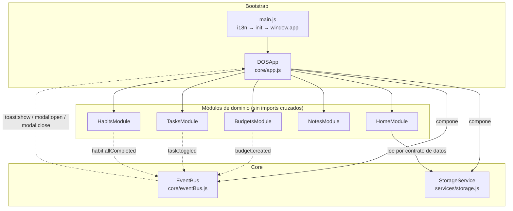

# Plan 05 — App Modular vs Monolito: Decisiones de Diseño y Presentación de Datos

> **Estado:** Aceptado — la arquitectura modular está en producción desde el
> cutover de v0.0.17 (rama `module-13-modules-refactor`, commit `e31c464`).
> **Relacionados:**
> [01-plan-javascript-to-modules-es6.md](./01-plan-javascript-to-modules-es6.md) ·
> [DESIGN.md §7](../DESIGN.md) · [STATUS.md](../STATUS.md) ·
> [docs/MODULAR_ARCHITECTURE.md](../docs/MODULAR_ARCHITECTURE.md)

---

## 1. Contexto y Cifras

El punto de partida era un contexto JavaScript legacy que superaba las
**3,600 líneas** conviviendo en un único scope global:

| Archivo legacy             | Líneas    | Rol                                                                          |
| -------------------------- | --------- | ---------------------------------------------------------------------------- |
| `assets/js/app.js`         | 3,538     | Monolito: TODA la lógica de la app (creció de 3,424 en el plan de migración) |
| `assets/js/main.js`        | 29        | Script suelto de arranque                                                    |
| `assets/js/theme.js`       | 12        | Script suelto de tema                                                        |
| `assets/js/analytics.js`   | 21        | Script suelto de analíticas                                                  |
| `assets/js/tailwindcss.js` | 23        | Helper de tema (referencia CDN)                                              |
| **Total contexto legacy**  | **3,623** | Cinco `<script>` sin módulos, un solo namespace                              |

En ese monolito convivían: el objeto global `app` con 30+ métodos, el objeto
`store` de persistencia, las funciones de render por pantalla
(`home()`, `budgets()`, `tasks()`, `habits()`, `notes()`), las utilidades
(`generateId`, `formatDate`, `escapeHtml`), los datos dummy y los templates
HTML concatenados a mano. El diagnóstico completo está en el
[plan 01](./01-plan-javascript-to-modules-es6.md); este documento no repite
ese diagnóstico: registra **por qué se decidió** salir de ahí y **cómo se
decide presentar los datos** en la arquitectura resultante.

El cutover se completó en `e31c464`
(`feat(core): completar cutover a arquitectura modular ES6`): 17 archivos,
+858 / −3,859 líneas, con el monolito eliminado del repositorio.

Situación resultante:

| Métrica                       | Monolito (legacy)    | Modular (actual)                      |
| ----------------------------- | -------------------- | ------------------------------------- |
| Líneas del archivo más grande | 3,538 (`app.js`)     | 656 (`modules/budgets/templates.js`)  |
| Archivos JS de la app         | 5                    | ~30 módulos ES6                       |
| Archivos > 600 líneas         | 1                    | 2 (656 y 649)                         |
| Scope compartido              | Un global único      | Un scope por archivo                  |
| Dependencias                  | Implícitas (globals) | Explícitas (`import`/`export`)        |
| Testing aislado               | Casi imposible       | 275 tests con Vitest (15 archivos)    |
| Persistencia                  | `store` inline       | `dos-app-data-v2` con migración v1→v2 |

> **Nota honesta:** la modularización no redujo el total de líneas de la app
> (pasó de ~3,600 a ~7,600, incluyendo funcionalidad nueva post-cutover como
> `tagInput`, `dueDatePicker`, `sound` o `analytics` expandido). Lo que baja
> es la **complejidad por archivo** (el máximo es 5.4× menor) y el
> **acoplamiento**. Ese era el objetivo; el conteo total de líneas no era un
> driver de la decisión.

---

## 2. La Decisión Central: Modular o Monolito

### 2.1 Opciones evaluadas

| Opción                                      | Descripción                                                                                           | Veredicto                                                                                                                                                           |
| ------------------------------------------- | ----------------------------------------------------------------------------------------------------- | ------------------------------------------------------------------------------------------------------------------------------------------------------------------- |
| **A. Mantener el monolito**                 | Seguir creciendo `app.js` con cada feature.                                                           | **Descartada.** Cada cambio tocaba un archivo de 3,500+ líneas compartido por 5 dominios; el riesgo de regresión y el costo de navegación crecían con cada feature. |
| **B. Varios `<script>` globales**           | Partir `app.js` en varios archivos sin módulos ES.                                                    | **Descartada.** No resuelve el scope global ni las dependencias implícitas; agrega un orden de carga frágil y colisiones de nombres.                                |
| **C. Módulos ES6 + orquestador + EventBus** | Módulos nativos `import`/`export`, un orquestador (`DOSApp`) que compone, y comunicación por eventos. | **Elegida.** Resuelve scope, dependencias y testeo sin bundler, y permite migración incremental dominio por dominio.                                                |

### 2.2 Drivers de la decisión

1. **Mantenibilidad:** encontrar la lógica de presupuestos no debe requerir
   scroll por 3,500 líneas de otros dominios.
2. **Testeabilidad:** aislar unidades exige poder importarlas sin arrastrar
   el mundo. Era el punto más débil del monolito y el driver más fuerte de
   la migración (plan 01, §Resumen).
3. **Aprendizaje:** este es un laboratorio de fundamentos; los módulos ES6
   nativos son el concepto de JavaScript moderno que la app debía
   ejemplificar.
4. **Restricción dura:** sin bundler ni build para el código de la app
   (regla de `AGENTS.md`); la opción C funciona con `<script
   type="module">` directo en el navegador.
5. **Offline/PWA:** los módulos ES6 se precachean en el service worker tan
   bien como un script único.
6. **Migración incremental:** la opción C permitió migrar un dominio por vez
   (budgets primero) manteniendo la app usable en cada paso.

### 2.3 Arquitectura resultante



### 2.4 Comparativa dimensión por dimensión

| Dimensión           | Monolito de 3,600+ líneas                       | App modular                                                            |
| ------------------- | ----------------------------------------------- | ---------------------------------------------------------------------- |
| Navegación          | Scroll y búsqueda textual en un archivo gigante | Ir a `modules/<dominio>/`, tres archivos con roles fijos               |
| Scope               | Global; colisiones y fugas de estado            | Un scope por módulo; nada global                                       |
| Dependencias        | Implícitas: `app`, `store`, `I18n` como globals | Explícitas: `import` visible al inicio de cada archivo                 |
| Comunicación        | Mutación directa de estado global ajeno         | `EventBus` con contrato `dominio:acción`                               |
| Persistencia        | `store.save()` inline mezclado con la UI        | `StorageService` inyectado; `toJSON`/`fromJSON` por modelo             |
| Testing             | Cargar todo o nada; efectos cruzados            | Módulo + dobles inyectados; 275 tests aislados                         |
| Riesgo de regresión | Cada cambio puede romper cualquier pantalla     | El cambio se confina a su dominio (salvo cambios de contrato de datos) |
| Reutilización       | Copiar/pegar funciones                          | Importar `utils/`, `services/`, `components/`                          |
| Carga inicial       | 1 archivo grande (todo o nada)                  | ~30 módulos precacheados por el SW (todo en cache)                     |
| Onboarding          | Leer 3,500 líneas                               | Leer `core/app.js` (649) + el dominio que toque                        |

---

## 3. Decisiones de Diseño de la Arquitectura

Cada decisión se registra con su justificación y la alternativa que se
descartó, para poder re-evaluarla si el contexto cambia.

### AD-01 — Módulos ES6 nativos, sin bundler

**Decisión:** la app se divide en archivos ES6 cargados con
`<script type="module">` y `import`/`export` explícitos. No se introduce
bundler ni build para el código de la app (solo para tooling de tests).

**Por qué:** elimina el scope global, hace visibles las dependencias, y los
navegadores soportan módulos de forma nativa — se cumple la restricción "sin
build step" del proyecto. Deja el terreno listo para tree-shaking si algún
día se adopta un bundler.

**Alternativa descartada:** varios `<script>` globales (opción B, §2.1).

### AD-02 — `DOSApp` como raíz de composición, no dios-objeto

**Decisión:** un único orquestador (`core/app.js`, 649 líneas hoy) que solo
posee **infraestructura global**: routing de pantallas, modal, toasts, undo,
tema y gestión de datos (export/import/reset/clear). La lógica de dominio
vive en los módulos.

**Por qué:** el riesgo del monolito era concentrar lógica. Si `DOSApp`
volviera a acumular reglas de negocio, el problema se repetiría en pequeño.

**Regla práctica:** si un método de `DOSApp` necesita conocer reglas de un
dominio, debe delegar en el módulo (como `filterTasks()` delega en
`TasksModule`). Techo presupuestado: ~800 líneas.

### AD-03 — Comunicación entre módulos solo vía `EventBus`

**Decisión:** prohibido importar un módulo de dominio desde otro módulo de
dominio. Toda comunicación pasa por el bus con nombres `dominio:acción`
(`budget:created`, `task:toggled`, `toast:show`, `modal:open`).

**Por qué:** agregar un módulo no exige modificar los existentes; los
eventos son el contrato público; el bus atrapa errores por handler sin
romper a los demás suscriptores.

**Contrapartida:** sin tipos estáticos, el contrato vive en la convención de
nombres y en el listado de eventos de `DESIGN.md` §7.1.

### AD-04 — Inyección de dependencias por constructor

**Decisión:** los módulos reciben `(storage, eventBus, i18n)` por
constructor; no importan servicios con estado.

```javascript
// assets/js/modules/budgets/index.js
export class BudgetsModule {
  constructor(storage, eventBus, i18n) {
    this.storage = storage
    this.eventBus = eventBus
    this.i18n = i18n
    this.budgets = []
  }
}
```

**Por qué:** en los tests se inyectan dobles (storage falso, bus de
prueba — ver `tests/tasks.test.js`), evitando singletons ocultos y
permitiendo instanciar el módulo aisladamente.

### AD-05 — Contrato común de módulo: `init` / `render` / `reload`

**Decisión:** todo módulo implementa:

- `init()` — carga datos, resuelve contenedores DOM y bindea listeners
  **una sola vez**.
- `render()` — pinta la pantalla desde el estado en memoria.
- `reload()` — recarga datos del storage y re-renderiza **sin duplicar
  listeners** del bus.

**Por qué:** el orquestador puede gestionar import/reset/clear de forma
genérica (`_reloadModules()` itera `Object.values(this.modules)`); el orden
de instanciación deja de importar; los listeners del contenedor sobreviven
al re-render (ver PD-04).

### AD-06 — Encapsulado de dominio por carpeta

**Decisión:** cada dominio vive en `modules/<dominio>/` con tres roles fijos:

| Archivo        | Rol                                                              |
| -------------- | ---------------------------------------------------------------- |
| `index.js`     | Coordinación: DOM, eventos, persistencia, modales                |
| `models.js`    | Clases con estado y reglas de negocio (`toJSON`/`fromJSON`)      |
| `templates.js` | Funciones puras de vista (reciben modelo + i18n, devuelven HTML) |

**Por qué:** dentro de un dominio el acoplamiento es aceptable y deseable
(cohesión); los tests de `models.js` no dependen del DOM; `templates.js` es
pura y auditable. Ejemplo real: `budgets/` = index 290 + models 207 +
templates 656 líneas.

### AD-07 — Capas compartidas con reglas de dependencia

**Decisión:** lo transversal al dominio se organiza en capas:

- `services/` — con estado y ciclo de vida (`storage`, `i18n`,
  `visitTracker`); se inyectan, no se importan desde módulos.
- `utils/` — helpers puros sin estado de app (`date`, `html`, `id`;
  `confetti`/`sound` tocan DOM pero no datos).
- `components/` — widgets reutilizables entre dominios (`tagInput`,
  `dueDatePicker`, `shareModal`).
- `data/` — semilla de demo (`demoData.js`), separada de la lógica.

**Regla de dependencia:** `core → modules → {services, utils, components,
data}`. `utils` no importa de `modules` ni de `services` (sin ciclos).

### AD-08 — Fachada `window.app` para handlers inline (deuda documentada)

**Decisión transitoria:** `main.js` expone `window.app = app` con 14
métodos para los `onclick`/`oninput`/`onchange` del HTML estático.

**Por qué:** permitió completar el cutover sin reescribir el template
`index.html` de una sola pieza. Está documentada como deuda técnica en
`DESIGN.md` §4.4 y `STATUS.md`.

**Plan de retiro:** migrar los handlers restantes a delegación
`data-action` (como ya hacen los contenedores de los módulos, PD-04) y
eliminar la fachada.

### AD-09 — Persistencia por contrato de datos

**Decisión:** una única clave `dos-app-data-v2` particionada por dominio
(`storage.get("tasks")`, `storage.get("budgets")`, ...). Cada modelo define
`toJSON()`/`fromJSON()`. `StorageService` migra `dos-app-data-v1`
automáticamente. Tras import/reset/clear, `DOSApp._reloadModules()` llama
`reload()` en todos los módulos.

**Por qué:** los módulos no se conocen entre sí pero comparten formato de
datos. `HomeModule` deriva sus KPIs leyendo `tasks`, `habits`, `budgets` y
`notes` del storage sin importar ningún módulo.

**Consecuencia:** cambiar la forma de un modelo es un cambio de contrato que
obliga a revisar a los consumidores (Home y el propio storage). Dichos
cambios van acompañados de migración (como la de v1→v2).

### AD-10 — El testing como decisión de arquitectura

**Decisión:** Vitest + jsdom; un archivo de test por módulo/servicio/util;
`localStorage` mockeado; imports relativos al código fuente.

**Por qué:** la testeabilidad fue un driver de la migración (plan 01). El
diseño por inyección (AD-04) y los templates puros (AD-06) hacen posible
aislar unidades; hoy corren 275 tests en 15 archivos con `npm test` y nada
de eso era viable contra el monolito.

---

## 4. Decisiones de Presentación de Datos

La presentación se rige por diez decisiones (PD) que hacen determinista y
segura la relación **datos → DOM**.

### PD-01 — Flujo unidireccional modelo → vista

La UI nunca muta datos directamente. Cada acción sigue el ciclo:

```text
data-action (o fachada)
  → método del módulo (valida con Model.validate)
  → muta el estado en memoria
  → _save() en storage
  → render()
  → eventBus.emit("dominio:acción")
```

El estado de UI efímero (filtro activo, pantalla actual, query de búsqueda)
vive en el módulo u orquestador y **no se persiste**. Solo el modelo va a
`localStorage`.

### PD-02 — Templates con escape automático (`html` / `raw`)

Todo HTML dinámico se genera con el tagged template `html` de
`utils/html.js`, que escapa cada interpolación; solo los fragmentos
producidos por otros templates propios se marcan como seguros con `raw()`.

```javascript
import { html, raw } from "../../utils/html.js"

const card = html`
  <h3>${budget.name}</h3>
  ${raw(budgetOverviewTemplate(totals, i18n))}
`
```

**Regla anti-XSS:** `raw()` jamás recibe input del usuario; solo salida de
templates propios ya escapados. Esto corrige de raíz el problema del
monolito, que concatenaba strings sin escapar.

### PD-03 — Re-render completo por `innerHTML`

**Decisión:** cada módulo re-renderiza su contenedor completo; no hay
diffing ni virtual DOM.

**Por qué:** a la escala de la app (decenas/cientos de nodos por pantalla) el
costo es imperceptible y elimina toda una clase de bugs de sincronía entre
estado y DOM. Las animaciones percibidas se conservan con
`transition-all duration-300` en las barras de progreso.

**Límite conocido:** si una pantalla supera unos cientos de nodos o el
re-render provoca jank medible, la salida es extraer sub-vistas por bloque
(KPIs, listas) — no introducir un framework.

### PD-04 — Delegación de eventos con `data-action`

**Decisión:** un solo listener por contenedor. Los botones declaran
intención y contexto con atributos `data-*`; el handler reparte con un
`switch`:

```javascript
this.container.addEventListener("click", e => {
  const target = e.target.closest("[data-action]")
  if (!target) return
  const action = target.dataset.action
  const budgetId = target.dataset.budgetId
  switch (action) {
    case "view-details":
      this.showDetailsModal(budgetId)
      break
    // ...
  }
})
```

**Por qué:** el listener vive en el contenedor (estático) y sobrevive a
cada re-render — no se re-bindea por nodo y no quedan listeners huérfanos;
el HTML de los templates queda auditable con `grep data-action`. Los
`onclick` inline solo se permiten en el shell estático de `index.html` vía
fachada (deuda AD-08).

### PD-05 — La lógica de presentación vive en el modelo

**Decisión:** las plantillas son declarativas; los cálculos son métodos del
modelo: `budget.getProgress()`, `budget.getStatus()`, `budget.getBalance()`,
`habit.getCurrentStreak()`. La plantilla solo formatea el resultado.

**Por qué:** esos cálculos son reglas de negocio (¿qué cuenta como
"alcanzado"?, ¿cómo se calcula el saldo?) y se testean sin DOM
(`tests/budgets.test.js`); evita duplicar fórmulas entre card y modal del
mismo dato.

### PD-06 — Formateo consistente de datos derivados

- **Dinero:** helper `money()` → `toFixed(2)` + código de moneda
  (`$1,200.00 MXN`). Monedas permitidas: `MXN`, `USD`, `EUR` (plan 04).
- **Porcentajes:** `pct.toFixed(1)` con barrera visual en 100%
  (`Math.min(pct, 100)`).
- **Fechas:** siempre `YYYY-MM-DD` local con `formatDate()`; parseo solo con
  `parseDateStringLocal()`; semana calendario lunes-domingo con
  `getCurrentWeekDates()` (plan 03). Prohibido `new Date("YYYY-MM-DD")`
  (interpreta UTC y desplaza el día).
- **IDs:** `generateId()` es opaco para el usuario; jamás se muestra, solo
  viaja en `data-*-id`.

### PD-07 — i18n con fallback en la vista

**Decisión:** todo texto visible pasa por `getMessage(i18n, key, fallback)` —
patrón `i18n?.getMessage(key) || fallback` — de modo que un template nunca
renderiza una clave cruda si la traducción falta. Las claves nuevas se
agregan primero a `assets/locales/es.json` y luego a `en.json`; el HTML
estático usa `data-i18n`.

**Por qué:** la ausencia de una traducción no debe romper la UI; y el
fallback en el template documenta el texto por defecto junto a la vista que
lo usa.

### PD-08 — Una sola superficie de superposición global

**Decisión:** un único modal (`#modal-backdrop` / `#modal-content`)
controlado por `DOSApp` mediante los eventos `modal:open` / `modal:close`;
toasts centralizados vía `toast:show`; undo global para acciones
destructivas; confeti y sonido con guardas defensivas. Los módulos **piden**
la superficie, nunca la administran.

**Por qué:** el monolito apilaba overlays con z-index mágicos; con un solo
dueño del overlay se garantiza que nunca haya dos modales abiertos ni un
toast bajo la nav inferior (el undo usa `bottom-24 md:bottom-8`).

### PD-09 — Dashboard desacoplado por datos

**Decisión:** `HomeModule` no importa otros módulos: lee
`tasks`/`habits`/`budgets`/`notes` del storage y deriva MITs, hábitos de
hoy, KPIs y actividad reciente (`_getMITs`, `_getTaskStats`,
`_getBudgetStats`).

**Por qué:** Home evoluciona sin tocar los módulos fuente y viceversa; el
acoplamiento es de **datos** (contrato de AD-09), no de código. Es la misma
idea del bus (AD-03) aplicada al agregado: nadie llama a nadie, todos leen
el mismo estado persistido.

**Contrapartida:** el formato de los modelos es un contrato compartido; un
cambio de forma debe revisar Home (y sus tests).

### PD-10 — Estados vacíos explícitos

**Decisión:** cada módulo define su template de vacío
(`emptyBudgetsTemplate`, `emptyMITsTemplate`, `emptyHabitsTemplate`,
`emptyActivityTemplate`, ...). La app jamás muestra un contenedor vacío sin
explicar qué hacer.

**Por qué:** un vacío sin guía parece un bug; el empty state es la primera
instrucción de uso de cada pantalla y sigue siendo i18n + escape automático
como cualquier otra vista.

---

## 5. Trade-offs y Límites Conocidos

Ninguna de las decisiones anteriores es gratis. Costes asumidos y su
mitigación:

| Coste asumido                              | Mitigación / criterio de revisión                                                                                        |
| ------------------------------------------ | ------------------------------------------------------------------------------------------------------------------------ |
| ~30 peticiones JS en vez de 1              | Service worker precachea los 24 archivos (`pwa-cache-v4`) y HTTP/2 multiplexa; segunda carga offline                     |
| Sin minificación ni tree-shaking de la app | Tailwind sí está compilado y minificado; el JS de la app es pequeño; bundler queda prohibido salvo tooling (`AGENTS.md`) |
| Re-render completo sin diffing (PD-03)     | Aceptable a esta escala; criterio objetivo: extraer sub-vistas si hay jank medible                                       |
| Más líneas totales (~3,600 → ~7,600)       | Repartidas en archivos ≤ 656 líneas; incluye features nuevas post-cutover                                                |
| `EventBus` sin tipos estáticos             | Convención `dominio:acción` + listado viviente en `DESIGN.md` §7.1                                                       |
| Fachada `window.app` (AD-08)               | Deuda con plan de retiro documentado (migrar a `data-action`)                                                            |
| Contrato de datos compartido (AD-09)       | Cambios de forma de modelo → revisar Home + migración en storage                                                         |

**Regla de re-evaluación:** si la app crece hasta necesitar routing con URL,
estado de servidor o componentes reutilizables con ciclo de vida propio, se
re-abren AD-01/AD-02 — no se parcha el orquestador hasta convertirlo en el
monolito original con otra sintaxis.

---

## 6. Guía: Cómo Agregar un Módulo Nuevo

Checklist que cristaliza las decisiones anteriores:

1. Crear `assets/js/modules/<dominio>/` con `index.js`, `models.js` y
   `templates.js` (AD-06).
2. `constructor(storage, eventBus, i18n)`; implementar `init()` / `render()`
   / `reload()` (AD-04, AD-05).
3. Agregar el contenedor propio en `index.html` (p. ej.
   `#<dominio>-screen` / `#<dominio>-list`) y el botón de navegación.
4. Comunicarse con `dominio:acción` vía bus; **nunca** importar otro módulo
   de dominio (AD-03).
5. Vista con `html`/`raw` y delegación `data-action` + `data-<entidad>-id`
   (PD-02, PD-04); cálculos como métodos del modelo (PD-05).
6. Claves i18n: primero `es.json`, luego `en.json`, con fallback en el
   template (PD-07); empty state propio (PD-10).
7. Persistir con `storage.set("<dominio>", ...)` y `toJSON`/`fromJSON`
   (AD-09); el modelo nuevo queda disponible para Home por contrato de datos.
8. Subir la versión de cache del SW (`pwa-cache-vN`) y agregar los archivos
   nuevos al precache.
9. Tests: unitarios de `models.js` + integración del módulo con dobles
   inyectados (AD-10); `npm test` en verde antes del commit.
10. Techo de tamaño: si `index.js` supera ~600 líneas, extraer a
    `components/` o sub-carpetas — no dejar crecer archivos gigantes (esa
    fue la lección del monolito).

---

## 7. Evidencia y Validación

- **Cutover:** commit `e31c464` (`feat(core): completar cutover a
  arquitectura modular ES6`): 17 archivos, +858 / −3,859; `assets/js/app.js`
  (3,538 líneas) eliminado; `sw.js` actualizado a `pwa-cache-v4`.
- **Tamaños actuales (verificados):** archivo más grande 656 líneas
  (`modules/budgets/templates.js`); `core/app.js` 649; ningún otro supera
  600.
- **Tests:** `npm test` → 275/275 pasando en 15 archivos (Vitest + jsdom),
  incluida la integración del core (`tests/app-core.test.js`).
- **Comandos de verificación:**

```bash
npm test                        # 275 tests, 15 archivos
wc -l assets/js/modules/*/index.js assets/js/core/app.js
git show e31c464 --stat         # diff del cutover
```

---

## 8. Referencias

- [plans/01-plan-javascript-to-modules-es6.md](./01-plan-javascript-to-modules-es6.md)
  — plan de migración y diagnóstico completo del monolito.
- [plans/03_correct_habits.md](./03_correct_habits.md) — fechas locales y
  semana calendario (base de PD-06).
- [plans/04_correct_budgets.md](./04_correct_budgets.md) — modelo
  savings/spending y monedas (base de PD-05/PD-06).
- [DESIGN.md](../DESIGN.md) §4.4 (fachada `window.app`), §7
  (arquitectura y eventos del bus), §9 (pantallas en detalle).
- [STATUS.md](../STATUS.md) — estado del cutover y correcciones de paso.
- [docs/MODULAR_ARCHITECTURE.md](../docs/MODULAR_ARCHITECTURE.md) —
  referencia temprana de la arquitectura.
